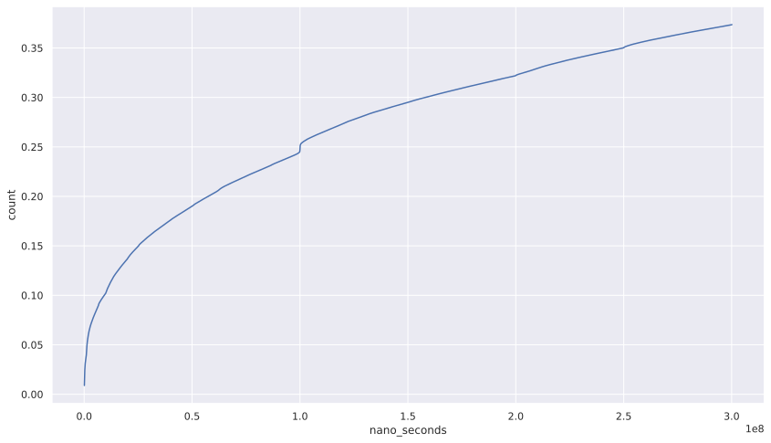
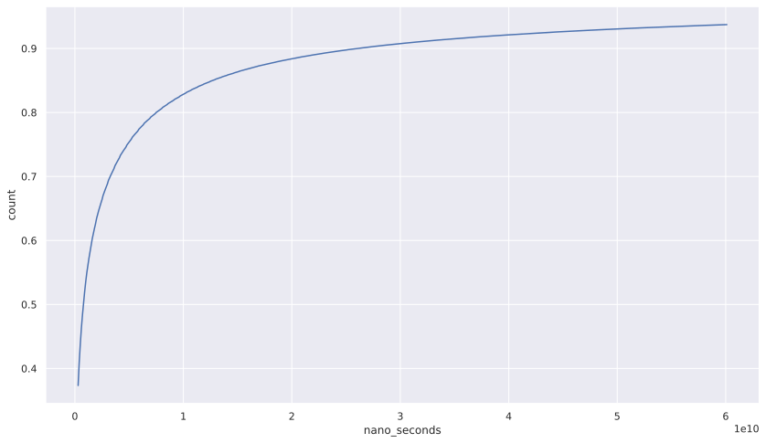
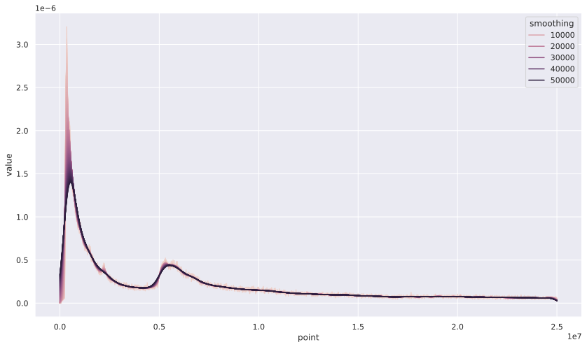

# Overview
Academic literature says that HFTs are capable of reacting to market in 3 milli seconds or less, and they makes up the majority of the orders that are ever submitted to the matching engine.  

Let's see if we can observe it in our dataset.

# Methodology and Result
We measure the trader's speed by the amount of time between actions.  
Order is created, modified or deleted only when a trader sends the instruction to do so; hense the time between these 3 updates can be used to measure the capability of the trader.  

We use `min_reaction_time` variable from the simulation result.

Table 1 shows is an descriptive statistics of the variable.

## Table1
TODO! replace theo table with the other dataset.
| label | value (nano seconds) |
| ----- | -------------------- |
| count | 5260774              |
| mean  | 129914469267.3827    |
| std   | 1768124731496.4177   |
| min   | 10654.0              |
| 25%   | 100041711.75         |
| 50%   | 782941790.0          |
| 75%   | 4775006267.0         |
| max   | 84045755529120.0     |

The fastest reaction observed is 10654 nano seconds.  
You must note that this number includes *the time that it took for the matching engine to set the timestamp of the event*.   

[Osaka Exchange advertise that it's system is capable of processing orders in 40 micro seconds in 50% of the time](https://www.jpx.co.jp/systems/derivatives-trading/01.html). 
I should note that they don't tell exactly when they generate the timestamp they set on the message, but it's still pretty impressive.

Regardless, HFTs must be making decision in less than the reaction time which we observed.

Although this sounds pretty fast, it seems to be *physically* possible since it only takes 10,000 nano seconds to send [1K bytes over 1Gbps network](https://gist.github.com/jboner/2841832).
Osaka Exchange uses OUCH protocol for creawting/updating/deletion orders. Lenght of each instruction sent by the client is 48 bytes, 26 and 9 bytes long respectively based on the trading specification from another exchange. (https://www.japannext.co.jp/pub_data/pub_onboarding/Japannext_PTS_OUCH_Equities_v1.11.pdf)
This didn't come from Osaka, but they should be somewhat similar in one way or another.

## Table 2
Table 2 shows the quantile of `min_reaction_time`.
It shows that more than 90% of orders are updated in less than 30 seconds, and more than 67% of orders are from traders who has the capacity to update it's order in less 0.25 seconds, which is the amount of time that humans need to react.

We can confirm that what the previous literatures suggests can be observed within our dataset.

This is the cumluative frequency distribution of orders' reaction time. 
First image shows the distribution of orders less than 3e8 nano seconds, while the 2nd image shows orders' reaction time of which is less than 1e10 nano seconds.

The image is splited in two for the better viewing experience.

TODO! replace the table with the full dataset

## Table 3
Following image whos the KDE of orders whose `min_reaction_time` is less than 2.5e7 nano seconds.  
Smoothing becomes bigger as the color of the plot becomes darker.  

KDE clearly shows that there are two significant peaks and peaks only appears when the `min_raction_time` is less than 1e7 nano seconds. 

# Conclusion
HFTs are pretty fast and it appears that we can observe what it is being said in the main stream about HFTs.

They make up the majority of the orders and they trade at non human speed with dedicated infrastructure.
