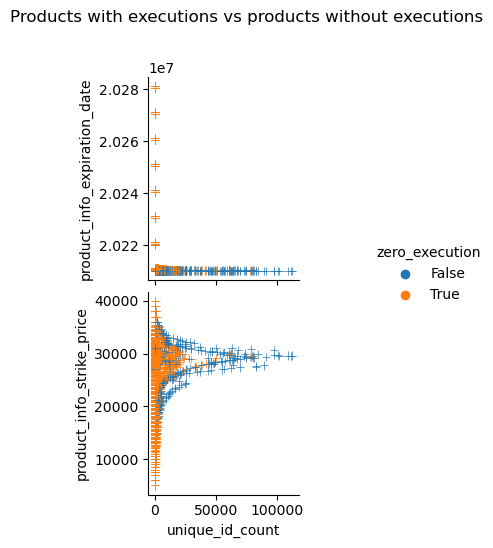

# Overview
I'm assuming that the `speed` of orders are going to be some metrics that you can use it 

Just because you can trade at 10,000 nano seconds doesn't mean that you would.  

I will try to identify non-speed *traits* that high speed traders possess to predict how fast a trader can get.  

High speed traders should be more sophisticated, thus it should provide some pieces of information that may help you with identifying market trend.  
Additionally, they are *abusive* and *unfair* according to some academic literature; This should allow me to have an insight into that argument.

## List of questions to answer
- How likely do orders get executed, instead of getting deleted? 
- Is more likely for faster orders to get deleted?
- Is the rate of order deletion/execution same among all products or is deletion rate higher in certain products?

# Dataset
You can find the copy of the data on kaggle.

# How likely do orders get executed, instead of getting deleted? 

# Can you predict the order's speed with Light GBM?
If the speed of the orders are tighed to some of the variables in some obvious way, it shouldn't be difficult to predict it's speed by using Light BGM.

I naively passed the dataset to Light GBM to see how things will turn out and here are the results.

- Metrics

- Feature Importance

It's pretty clear that it's not working.  
The model predicts *TODO*% of prediction is smaller than 0; Which is clearly wrong.

I can think of few ways to improve it.
- custom loss function  
 
    The acceptable error differs depending on order's minimum possible reaction time.

    Say there was an order submitted by a trader that can only react after 30 seconds. Predicting this order to be capable of reacting in 0.1 seconds is troubling; While 0.1 second is not something that can be carried out by a human, 30 seconds can be done manually.  
    Consider a case where it an order is predicted to react in 59.9 seconds, instead of 29.9 seconds; The error rate is the same, but this is lot more acceptable than the previous example.
    
    Furthermore, 29.9 seconds of difference would be *enough accurate* if you are talking about an order that is submitted by a trader who can only delete his order only after an hour.  

    I think you could improve the accuracy by creating a tailored loss function.

- Classification instead of regression

    As I mentioned above, there are kinds of errors that I can tolerate and kinds of errors that I can't tolerate.  
    I could transform the target value into a boolean that tells whether the target falls into certian range.  
    This is lot simpler than creating a custom loss function.  

- More Features!

    You can certainly add more features.
    Some features that I can come up with is, expiration date, number of new orders observed as of creation of the order order, money-ness... etc.

- non-random splits
  
    I splitted the dataset randomly and with no weight assuming that no market participants that are unique to certain financial products.  
    
    Products with different characteristics could have different kind of market participants. For example, speculative retial traders you'd often see on WSB would prefer trading OTM options rather than ITM options.

## How does difference in strike price, product type, trading volume relate to order activity?
Let's check if there are differences between product in temrs of order activity.

Below chart plots the number of maker orders that were observed and recorded 

## Do faster order more likely to get deleted, instead of getting it self executed?
According to some academic literature, orders are more likely to end up getting deleted if they are from HFT firm.

# Discussion
## Orders waiting for someone to make a mistake

Some option products expiring in months or years seem to have no market maker with.

 orders sitting at 1 JPY is clearly 